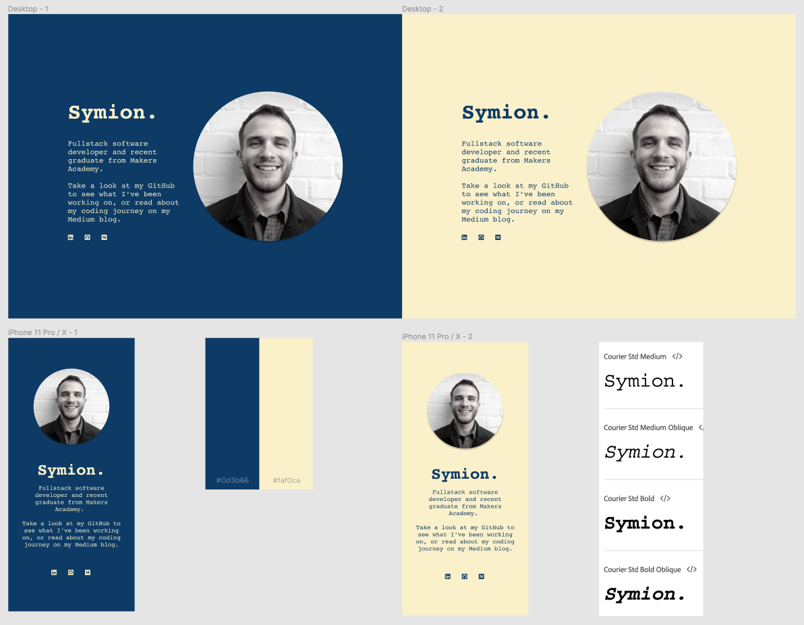
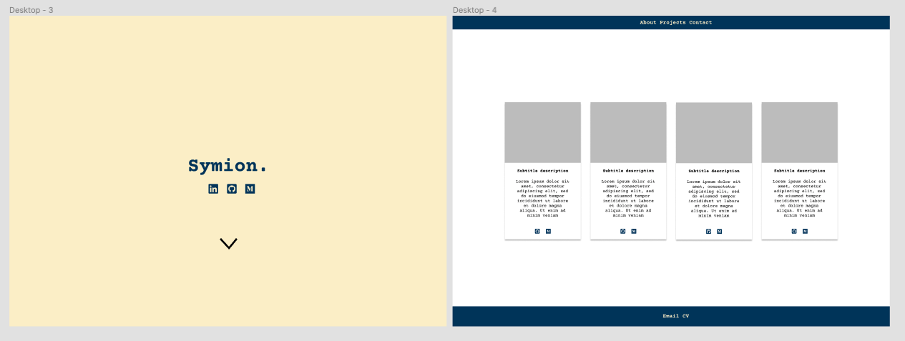

## [symion.co.uk](http://symion.co.uk/)

An exercise in design, this website was created orignally created as a single landing page linking to my various professional profiles. 

I used a combination of HTML, CSS, JavaScript and jQuery and deployed my serverless website using Netlify. 

Before writing any code, I created various mockups what I wanted my website to look like on various screen resolutions using Figma. This gave me the flexibility to easily change my design. 

In order to make the website responsive, I used a combination of CSS flexbox and media queries.

The typewriter annimation was created through following this [Traversy Media](https://www.youtube.com/watch?v=POX3dT-pB4E&ab_channel=TraversyMedia) tutorial.

### Figma Design Process

I decided to expand my website to include a project section. I additonal mockups on Figma and created a project card which could be used for each project. 

